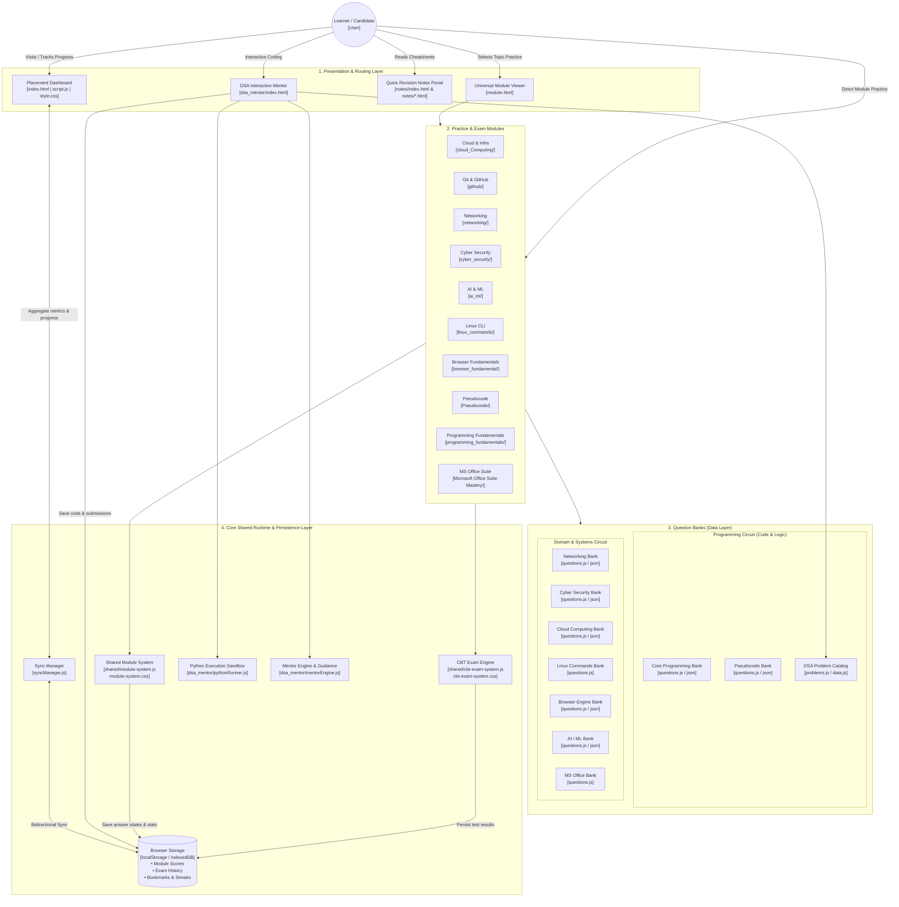

# PlacementPrep — System Architecture & Project Reference Manual

> **Purpose:** Master reference blueprint documenting the end-to-end architecture, folder structure, component relationships, data flow, question schemas, and runtime systems of the **PlacementPrep** platform.

---

## 1. High-Level System Architecture Diagram



---

## 2. Directory Structure & File Map

```
dheerajdogra102003-create-placementprep/
│
├── index.html                         # Main platform landing page & student dashboard
├── module.html                        # Universal single-page application module host/runner
├── script.js                          # Dashboard logic, progress charts, streak calculation
├── style.css                          # Global styles, Aurora glow, Cyber Grid, themes (dark/light)
├── syncManager.js                     # Unified storage sync across modules and main dashboard
│
├── ai_ml/                             # Artificial Intelligence & Machine Learning Module
│   ├── index.html                     # AI/ML landing and quiz interface
│   ├── questions.js                   # JS array export of AI/ML questions
│   ├── questions.json                 # JSON schema of AI/ML questions (search/filter friendly)
│   ├── script.js                      # AI/ML module controller
│   └── style.css                      # AI/ML themed styles
│
├── browser_fundamental/               # Web Browsers, DOM, HTTP & Web Engines Module
│   ├── index.html
│   ├── questions.js
│   ├── questions.json
│   ├── script.js
│   └── style.css
│
├── cloud_Computing/                   # AWS, Azure, GCP, Virtualization & Cloud Architecture
│   ├── index.html
│   ├── questions.js
│   ├── questions.json
│   ├── script.js
│   └── style.css
│
├── cyber_security/                    # Cryptography, OWASP, Network Security, Protocols
│   ├── index.html
│   ├── questions.js
│   ├── questions.json
│   ├── script.js
│   └── style.css
│
├── dsa_mentor/                        # Interactive In-Browser Python DSA Mentor & Solver
│   ├── index.html                     # DSA Mentor workspace UI (Editor, Problem List, Console)
│   ├── data.js                        # Categorized DSA metadata (Topics, Patterns, Companies)
│   ├── mentorEngine.js                # AI/Heuristic mentor analyzing code & generating hints
│   ├── problems.js                    # LeetCode / MNC interview problem catalog & test suites
│   ├── pythonRunner.js                # WebAssembly / Pyodide Python execution engine
│   ├── script.js                      # Workspace coordinator (editor, run, submit, hint triggers)
│   ├── storage.js                     # DSA problem solved state, saved drafts, submission log
│   └── style.css                      # Split-pane IDE layout, dark terminal theme
│
├── github/                            # Git Version Control & GitHub Workflows
│   ├── index.html
│   ├── questions.js
│   ├── questions.json
│   ├── script.js
│   └── style.css
│
├── linux_commands/                    # Linux Shell, Bash, Permissions, Process Management
│   ├── index.html
│   ├── questions.js
│   ├── script.js
│   └── style.css
│
├── Microsoft Office Suite Mastery/    # MS Excel, Word, PowerPoint (Crucial for MNC Aptitude/Ops)
│   ├── index.html
│   ├── questions.js
│   ├── script.js
│   └── style.css
│
├── networking/                        # OSI Model, TCP/IP, Routing, DNS, Subnetting, Sockets
│   ├── index.html
│   ├── questions.js
│   ├── questions.json
│   ├── script.js
│   └── style.css
│
├── notes/                             # Fast Revision & Company-Specific Cheatsheets
│   ├── index.html                     # Notes home / syllabus catalog
│   ├── accenture-web-coding.html      # Accenture specific web development & pseudocode notes
│   ├── ai-ml-dl.html                  # Core AI/ML formulas, activation functions, loss summaries
│   ├── cloud-computing.html           # Cloud models (IaaS/PaaS/SaaS) & architectural concepts
│   ├── cybersecurity.html             # Common attacks, TLS handshake, cryptographic algorithms
│   ├── git-github.html                # Git commands cheat sheet, branching strategies
│   └── networking.html                # Protocols, ports, subnetting, TCP vs UDP comparison
│
├── programming_fundamentals/          # C, C++, Java, OOPs, Memory, Pointers & Compilers
│   ├── index.html
│   ├── questions.js
│   ├── questions.json
│   ├── script.js
│   └── style.css
│
├── Pseudocode/                        # MNC Technical Pseudocode (Accenture, Capgemini, Cognizant)
│   ├── index.html
│   ├── questions.js
│   ├── questions.json
│   ├── script.js
│   └── style.css
│
├── scratch/                           # Automation & data pipeline output
│   └── all_modules_result.json        # Compiled master dataset of all questions & validation
│
└── shared/                            # Shared Reusable Platform Engines
    ├── cbt-exam-system.css            # Styles for timed Computer Based Test (CBT) environment
    ├── cbt-exam-system.js             # CBT engine: countdown timer, question palette, review status
    ├── module-system.css              # Standardized module UI (Flashcards, Practice, Exam cards)
    ├── module-system.js               # Common module driver: progress tracking, answer checking
    └── module-template.html           # Boilerplate blueprint for creating any new practice module
```

---

## 3. Architecture Breakdown & Component Roles

### 3.1 Presentation & Hub (`index.html`, `script.js`, `style.css`)
- **Theme Engine:** Instant dark/light mode toggle with theme persistence in `localStorage`.
- **Visual Design:** Cyber Grid mesh, dynamic Aurora ambient gradients, interactive WebGL canvas particle system, and responsive card layouts.
- **Analytics & Tracking:** Aggregates metrics from all 11 modules via `syncManager.js`:
  - Overall readiness percentage
  - Total questions attempted vs total available
  - Module-by-module mastery radar / bars
  - Daily practice streak counter

### 3.2 Question & CBT Exam Modules
Each domain folder (e.g., `cloud_Computing`, `networking`, `cyber_security`, `Pseudocode`) contains:
- **Practice Mode:** Instant feedback on selection, reveals deep explanation, "Why other options are wrong", and MNC placement tips.
- **Flashcard Mode:** Flip-card mode for quick recall and formula revision before interviews.
- **CBT (Computer-Based Test) Exam Mode (`shared/cbt-exam-system.js`):**
  - Mimics actual MNC assessment platforms (TCS iON, AMCAT, CoCubes, Superset).
  - Question status palette: *Not Visited*, *Not Answered*, *Answered*, *Marked for Review*, *Answered & Marked for Review*.
  - Full-screen countdown timer with auto-submit on expiry.
  - Final score breakdown with negative marking support and section analysis.

### 3.3 Question Bank Schema Standard
Every `questions.js` / `questions.json` adheres to the following standard schema:

```json
{
  "id": "MOD_001",
  "concept": "Core Concept Name",
  "difficulty": "Easy | Medium | Hard",
  "question_type": "conceptual | code_output | scenario_based",
  "question": "The question text prompt",
  "codeSnippet": "// Optional syntax-highlighted code block",
  "options": {
    "A": "First choice",
    "B": "Second choice",
    "C": "Third choice",
    "D": "Fourth choice"
  },
  "correct_answer": "A",
  "explanation": "Comprehensive rationale explaining why option A is correct.",
  "why_other_options_are_wrong": {
    "B": "Why B is incorrect.",
    "C": "Why C is incorrect.",
    "D": "Why D is incorrect."
  },
  "placement_tip": "High-frequency MNC exam pattern, shortcut, or trap to watch out for."
}
```

### 3.4 DSA Interactive Mentor (`dsa_mentor/`)
- **Interactive Code Editor:** Split-screen layout for problem description, Python code editor, input/output console, and AI mentor panel.
- **In-Browser Execution (`pythonRunner.js`):** Uses Pyodide (WebAssembly Python) to execute code directly client-side without requiring a backend server.
- **Mentor Guidance Engine (`mentorEngine.js`):** Provides progressive tiered hints (1. Conceptual direction -> 2. Algorithm breakdown -> 3. Edge-case alert -> 4. Optimal complexity guidance) without giving away the direct code.
- **Local Storage Manager (`storage.js`):** Tracks solved problems, time spent, execution speed, and past submissions.

### 3.5 State Management & Storage Key Registry (`syncManager.js`)
All module states are stored in browser `localStorage` using structured keys:

| Storage Key | Type | Description |
|---|---|---|
| `placementPrep_theme` | `string` | `'dark'` or `'light'` |
| `placementPrep_streak` | `object` | `{ currentStreak, lastActiveDate, bestStreak }` |
| `placementPrep_module_<module_id>` | `object` | `{ completed: [], bookmarks: [], examHistory: [] }` |
| `placementPrep_dsa_progress` | `object` | `{ solvedIds: [], drafts: {} }` |
| `placementPrep_global_stats` | `object` | Aggregated score, total questions solved, time spent |

---

## 4. Key Workflows

### 4.1 Candidate Practice Workflow
1. Candidate lands on `index.html` and selects a topic or clicks "Resume Practice".
2. `module.html` or `<module>/index.html` loads the topic's `questions.js`.
3. Candidate chooses between **Flashcards**, **Practice Quiz**, or **Timed CBT Exam**.
4. Responses are recorded in real-time, evaluated, and synced via `syncManager.js`.
5. Return to `index.html` automatically reflects updated mastery bars and streak increments.

### 4.2 Adding a New Module
1. Copy `shared/module-template.html` into a new directory (e.g., `operating_systems/`).
2. Populate `questions.js` and `questions.json` following the standard schema.
3. Link `shared/module-system.css`, `shared/module-system.js`, and `shared/cbt-exam-system.js`.
4. Register the new module ID inside `syncManager.js` and add its card to `index.html`.

---

*Generated and verified for project reference: `dheerajdogra102003-create-placementprep`.*
